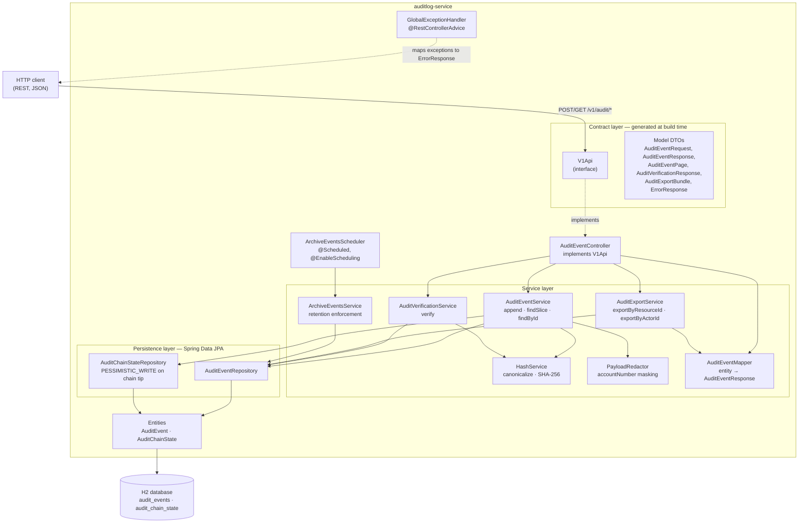
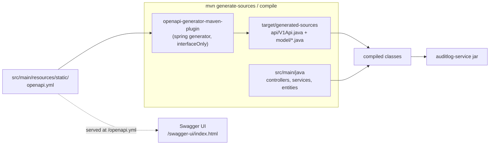
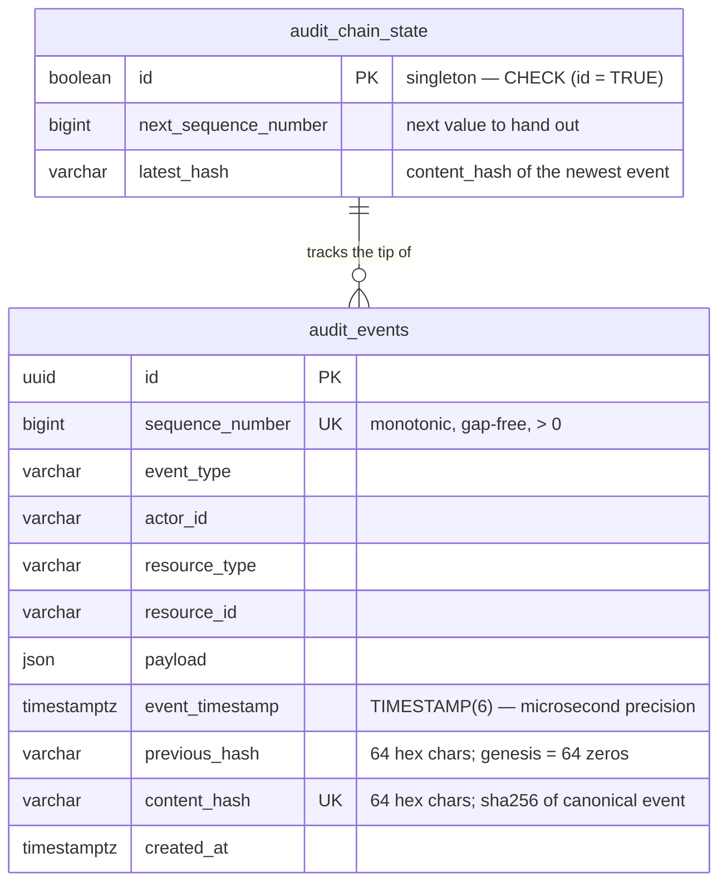
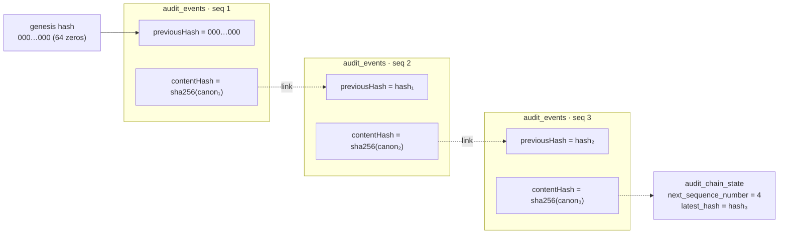
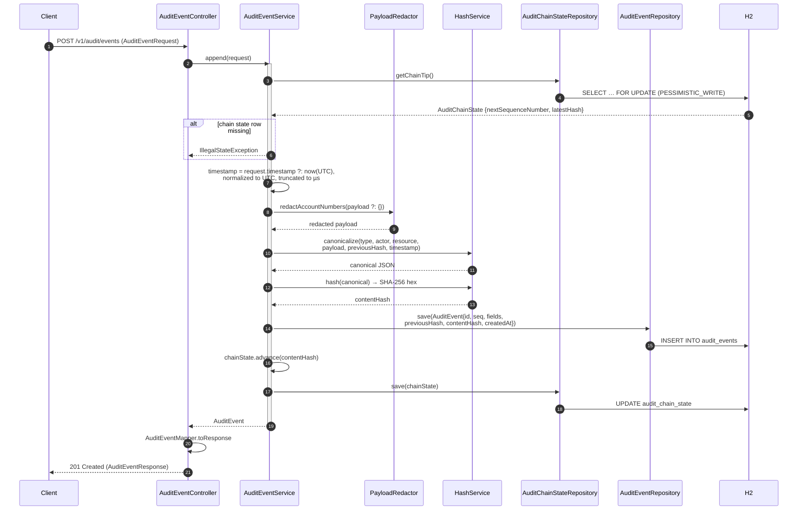
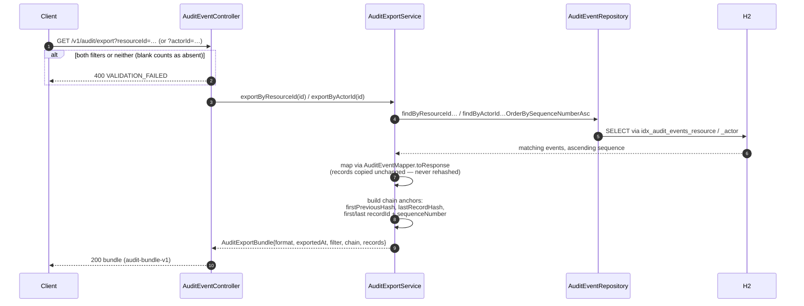
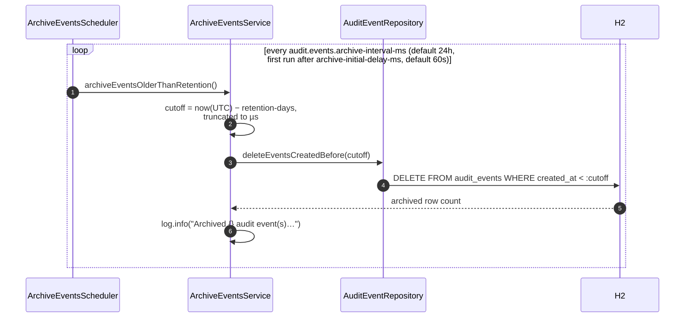

# Architecture — auditlog-service

`auditlog-service` is a Spring Boot service that maintains an **append-only,
tamper-evident audit log**. Every event is assigned a monotonic sequence number
and a SHA-256 content hash that commits to the event's fields *and* to the hash
of the preceding record, forming a hash chain. The chain makes any edit,
deletion or reordering of history detectable by re-walking the log.

- **Framework:** Spring Boot 4.1.1, Java 25
- **API style:** contract-first — `V1Api` and the model DTOs are generated from
  `src/main/resources/static/openapi.yml` by the `openapi-generator-maven-plugin`
- **Persistence:** Spring Data JPA (Hibernate) over an in-memory H2 database;
  schema owned by `src/main/resources/sql/schema.sql` (`ddl-auto: none`)
- **Quality gate:** JaCoCo enforces ≥ 90% line coverage on `mvn verify`

---

## 1. High-level architecture



### Layer responsibilities

| Layer | Classes | Responsibility |
| ----- | ------- | -------------- |
| Contract (generated) | `V1Api`, `model.*` | Declares the HTTP surface and DTOs from `openapi.yml`. Never edited by hand — the OpenAPI spec is the source of truth. |
| Controller | `AuditEventController` | Thin adapter: enforces the cross-field rules the spec cannot express (`from < to`, exactly-one-export-filter), delegates everything else to services. |
| Service | `AuditEventService`, `AuditVerificationService`, `AuditExportService`, `ArchiveEventsService` | All business logic and transaction boundaries (`@Transactional`). |
| Support | `HashService`, `PayloadRedactor`, `AuditEventMapper` | Stateless helpers: canonicalization + hashing, field redaction, entity→DTO mapping. |
| Scheduler | `ArchiveEventsScheduler` | Decides *when* retention runs; contains no retention logic itself. |
| Persistence | `AuditEventRepository`, `AuditChainStateRepository` | JPQL queries and the pessimistic lock that serializes appends. |
| Entity | `AuditEvent`, `AuditChainState` | JPA mappings of the two tables. |

---

## 2. Contract-first build flow

The HTTP contract is defined once in `openapi.yml`; the Java interface and DTOs
are produced during the build, so implementation can never drift from the spec.



- `interfaceOnly` + `skipDefaultInterface` mean the plugin emits a plain
  interface (`V1Api`) and POJOs only — `AuditEventController` supplies all
  behavior by implementing `V1Api`.
- Generated sources are excluded from the JaCoCo coverage gate.
- `springdoc` is configured to serve the contract file itself
  (`springdoc.swagger-ui.url: /openapi.yml`), so the Swagger UI documents
  exactly what the code implements.

---

## 3. Data model



### `audit_events`

One row per audit event. Constraints enforce the chain's integrity at the
database level: `sequence_number` and `content_hash` are unique,
`sequence_number > 0`, and both hash columns must be exactly 64 characters.

Composite indexes — `(actor_id, sequence_number)`,
`(resource_type, resource_id, sequence_number)`,
`(event_type, sequence_number)`, `(event_timestamp, sequence_number)` — keep
every filtered variant of keyset pagination on an index seek.

### `audit_chain_state`

A singleton table (the `CHECK (id = TRUE)` constraint guarantees at most one
row) holding the chain tip: the next sequence number to assign and the content
hash of the newest event. `schema.sql` seeds the genesis row
(`next_sequence_number = 1`, `latest_hash = 64 zeros`) via an idempotent
`MERGE`, and appends read-and-lock this row, so it must exist before the first
event. `ddl-auto: none` ensures Hibernate never recreates the schema and
discards the genesis row.

---

## 4. The hash chain



Each record's `contentHash` is `SHA-256` of a canonical JSON document built by
`HashService.canonicalize`, with fields in a fixed order:

```
eventType, actorId, resourceType, resourceId, payload, timestamp, previousHash
```

Canonicalization rules that make the hash reproducible:

- **Payload keys are recursively sorted** (`{"b":2,"a":1}` → `{"a":1,"b":2}`);
  array order is preserved because it can be semantically significant. A missing
  payload canonicalizes to `{}`.
- **Timestamp is normalized to UTC and truncated to microseconds** — the
  precision of `TIMESTAMP(6) WITH TIME ZONE` — *before* hashing, so the value
  hashed is exactly the value the database stores and reads back.
- **`previousHash` is part of the hashed content.** That is what makes the log
  tamper-evident: an event cannot be moved, removed, or spliced into a different
  position without invalidating its own hash and every hash after it.
- The event's own `contentHash` is necessarily excluded from the canonical form.
- `HashService` uses a dedicated `ObjectMapper` rather than the application
  bean: canonicalization must never change, or every stored hash becomes
  unverifiable.

### Redaction

Before hashing and persistence, `PayloadRedactor` replaces a present
`accountNumber` payload field with the constant `[REDACTED]`. The clear-text
value is therefore never committed to by the content hash and never stored.
The match is by exact field name only — `null` and empty values are redacted,
lookalike names like `accountNumberLast4` are not. Responses re-apply the same
redaction defensively via `AuditEventMapper`.

---

## 5. Code flows

### 5.1 Appending an event — `POST /v1/audit/events`



Key points:

- **Serialization of appends.** `getChainTip()` takes a `PESSIMISTIC_WRITE`
  lock on the singleton chain-state row for the duration of the transaction.
  Two concurrent appends therefore cannot claim the same sequence number or
  chain onto the same previous hash — the second waits for the first to commit.
- **Atomicity.** The event `INSERT` and the chain-tip `UPDATE` happen in one
  `@Transactional` unit: either both land or neither does, so the tip always
  points at the newest persisted event.
- **Server-assigned fields.** The client supplies event content; the server
  assigns `id` (random UUID), `sequenceNumber`, `previousHash`, `contentHash`
  and `createdAt`. `timestamp` may be caller-supplied (when the event occurred)
  or defaults to now.

### 5.2 Querying events — `GET /v1/audit/events`

```mermaid
sequenceDiagram
    autonumber
    participant C as Client
    participant CTL as AuditEventController
    participant SVC as AuditEventService
    participant ER as AuditEventRepository
    participant DB as H2

    C->>CTL: GET /v1/audit/events?actorId=…&cursor=…&pageSize=…
    Note over CTL: generated contract enforces<br/>cursor ≥ 0, 1 ≤ pageSize ≤ 100
    alt from ≥ to
        CTL-->>C: 400 VALIDATION_FAILED
    end
    CTL->>SVC: findSlice(AuditEventQuery)
    SVC->>ER: findSlice(cursor, filters…, Limit.of(pageSize + 1))
    ER->>DB: SELECT … WHERE seq > :cursor AND filters<br/>ORDER BY seq ASC LIMIT pageSize+1
    DB-->>SVC: rows (up to pageSize + 1)
    SVC->>SVC: hasMore = rows.size() > pageSize;<br/>drop extra row;<br/>nextCursor = last.sequenceNumber
    SVC-->>CTL: AuditEventSlice{events, nextCursor, hasMore}
    CTL->>CTL: map each via AuditEventMapper.toResponse
    CTL-->>C: 200 AuditEventPage{content, pageSize, nextCursor, hasMore}
```

Key points:

- **Keyset (cursor) pagination on `sequenceNumber`.** Because sequence numbers
  are unique, monotonic and never rewritten, a cursor walk can neither skip nor
  repeat an event even while appends continue, and stays O(log n) at any depth.
  Offset paging would silently shift page boundaries on an append-only log.
- **`pageSize + 1` trick.** Reading one extra row reveals `hasMore` without a
  `COUNT` over a log that only grows; the extra row is discarded.
- **Filters are optional and AND-ed**; each `null` parameter disables its
  predicate in the single JPQL query (`AuditEventRepository.findSlice`). No
  total count is ever computed.
- See `docs/audit-events-pagination.md` for the full client contract.

### 5.3 Verifying the chain — `GET /v1/audit/verify`

```mermaid
sequenceDiagram
    autonumber
    participant C as Client
    participant CTL as AuditEventController
    participant VS as AuditVerificationService
    participant ER as AuditEventRepository
    participant HS as HashService
    participant DB as H2

    C->>CTL: GET /v1/audit/verify
    CTL->>VS: verify()
    VS->>ER: findAllInSequence()
    ER->>DB: SELECT * FROM audit_events ORDER BY sequence_number ASC
    DB-->>VS: all events
    VS->>VS: expectedSeq = 1, expectedPrev = genesis (64 zeros)
    loop for each event, in order
        VS->>VS: check sequenceNumber == expectedSeq<br/>else SEQUENCE_GAP
        VS->>VS: check previousHash == expectedPrev<br/>else PREVIOUS_HASH_MISMATCH
        VS->>HS: canonicalize(stored fields) → hash()
        HS-->>VS: recomputed hash
        VS->>VS: check recomputed == contentHash<br/>else CONTENT_HASH_MISMATCH
        VS->>VS: expectedPrev = contentHash; expectedSeq++
    end
    alt first violation found
        VS-->>CTL: {valid:false, recordsChecked, firstViolation{seq, recordId, type, message}}
    else chain intact
        VS-->>CTL: {valid:true, recordsChecked, firstViolation:null}
    end
    CTL-->>C: 200 AuditVerificationResponse
```

Three invariants are checked per record, and verification **stops at the first
violation**, reporting how many records were inspected including the offender:

1. **Sequence continuity** — sequence numbers increase by exactly one from 1
   with no gaps (`SEQUENCE_GAP`).
2. **Link integrity** — `previousHash` equals the content hash of the preceding
   record, or the genesis hash for record 1 (`PREVIOUS_HASH_MISMATCH`).
3. **Content integrity** — the stored `contentHash` equals the hash recomputed
   from the record's canonical content (`CONTENT_HASH_MISMATCH`).

The endpoint is read-only (`@Transactional(readOnly = true)`) and always
returns `200` — a broken chain is a result, not an error.

### 5.4 Exporting a verifiable bundle — `GET /v1/audit/export`



Key points:

- **Exactly one filter** — `resourceId` or `actorId` — is required, so an
  export can never silently widen its scope. An empty result is still a valid
  bundle (`recordCount: 0`, null anchors).
- **Partial-chain semantics.** A filtered export is usually not contiguous in
  the global chain, so each record keeps its original `previousHash` (which may
  reference an excluded record). The `chain` metadata anchors the segment to the
  global chain: `firstPreviousHash` names the hash before the first exported
  record, `lastRecordHash` the content hash of the last.
- **Records are authoritative and read-only** — copied out unchanged so a
  recipient can re-verify every hash independently with the documented
  canonicalization. The bundle is hash-verified but not signed.
- See `docs/audit-export.md` for the bundle format and the recipient-side
  verification checklist.

### 5.5 Retention / archival — scheduled



Key points:

- The scheduler is deliberately thin — it only decides *when* to run; all
  retention logic lives in `ArchiveEventsService`.
- There is **no separate archive store**: "archival" is a single bulk `DELETE`
  executed in the database in one transaction, so arbitrarily many expired rows
  are removed without loading them into memory.
- Configurable via `audit.events.retention-days` (default 30),
  `archive-interval-ms` (default 24h) and `archive-initial-delay-ms`
  (default 60s) in `application.yaml`.
- Note the deliberate tension with tamper-evidence: deleting old rows creates
  sequence gaps that `GET /v1/audit/verify` will report as `SEQUENCE_GAP`.
  Retention therefore trades verifiability of the full history for storage
  bounds — an operational choice driven by the retention setting.

---

## 6. Error handling

`GlobalExceptionHandler` (`@RestControllerAdvice`) maps every expected failure
to the contract's `ErrorResponse` (`{ "message", "code" }`):

| Exception | Status | `code` | Raised when |
| --------- | ------ | ------ | ----------- |
| `AuditEventNotFoundException` | 404 | `AUDIT_EVENT_NOT_FOUND` | Lookup by an unknown event id |
| `MethodArgumentTypeMismatchException` | 400 | `VALIDATION_FAILED` | A query parameter cannot be bound (e.g. non-numeric `cursor`) |
| `IllegalArgumentException` | 400 | `VALIDATION_FAILED` | Cross-field rules: `from ≥ to`, both/neither export filter |
| `ConstraintViolationException`, `HandlerMethodValidationException` | 400 | `VALIDATION_FAILED` | Contract parameter bounds (`pageSize`, `cursor ≥ 0`, …) |
| `MethodArgumentNotValidException` | 400 | `VALIDATION_FAILED` | Request body validation |

Unhandled failures propagate as Spring's default 500s — there is no catch-all,
so unexpected errors are not masked.

---

## 7. Concurrency and consistency

| Concern | Mechanism |
| ------- | --------- |
| Two appends claiming the same sequence number / chain tip | `PESSIMISTIC_WRITE` lock on the singleton `audit_chain_state` row, held for the whole `append` transaction |
| Chain tip diverging from the newest event | Event `INSERT` and tip `UPDATE` in one `@Transactional` unit |
| Stored value differing from hashed value | Timestamp normalized to UTC and truncated to `TIMESTAMP(6)` precision *before* hashing |
| Hash function changing under stored records | Dedicated, immutable `ObjectMapper` in `HashService`; fixed field order; `SHA-256` constant |
| Re-reading clear-text secrets | `accountNumber` redacted before hashing/persisting and again on the way out |
| Reads during concurrent appends | Keyset cursor on immutable `sequence_number`; read-only transactions for query/verify/export |

---

## 8. Source layout

```
src/main/java/com/persistent/assessment/auditlog/
├── AuditlogServiceApplication.java     @SpringBootApplication entry point
├── api/                                (generated) V1Api interface
├── model/                              (generated) request/response DTOs
├── controller/
│   └── AuditEventController.java       implements V1Api — all 4 endpoints
├── service/
│   ├── AuditEventService.java          append, findSlice, findById, chain tip
│   ├── AuditVerificationService.java   hash-chain walk + violation reporting
│   ├── AuditExportService.java         audit-bundle-v1 construction
│   ├── ArchiveEventsService.java       retention delete
│   ├── HashService.java                canonicalization + SHA-256
│   ├── PayloadRedactor.java            accountNumber → [REDACTED]
│   └── AuditEventMapper.java           entity → AuditEventResponse
├── repository/
│   ├── AuditEventRepository.java       slice/sequence/export queries, bulk delete
│   └── AuditChainStateRepository.java  locked chain-tip read
├── entity/
│   ├── AuditEvent.java                 audit_events mapping
│   └── AuditChainState.java            singleton tip row + advance()
├── exception/
│   ├── AuditEventNotFoundException.java
│   └── GlobalExceptionHandler.java
└── scheduler/
    └── ArchiveEventsScheduler.java     @Scheduled trigger + @EnableScheduling

src/main/resources/
├── application.yaml                    datasource, springdoc, audit.events.*
├── sql/schema.sql                      tables, constraints, indexes, genesis row
└── static/openapi.yml                  the API contract (source of truth)
```

## 9. Further reading

- `docs/audit-events-pagination.md` — cursor pagination contract and rationale
- `docs/audit-export.md` — bundle format, partial-chain semantics, verification
- `src/main/resources/static/openapi.yml` — full request/response schemas
- `SETUP.md` — build, run, and configuration reference
